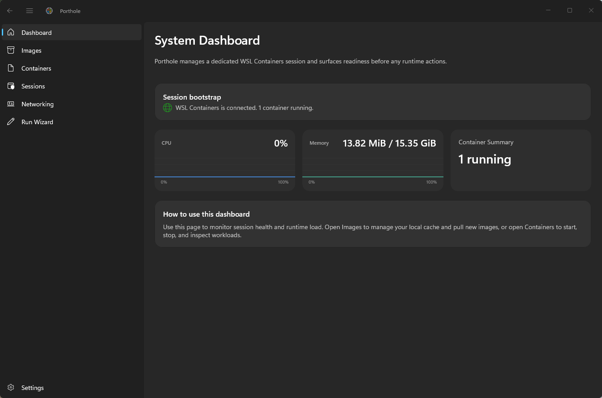
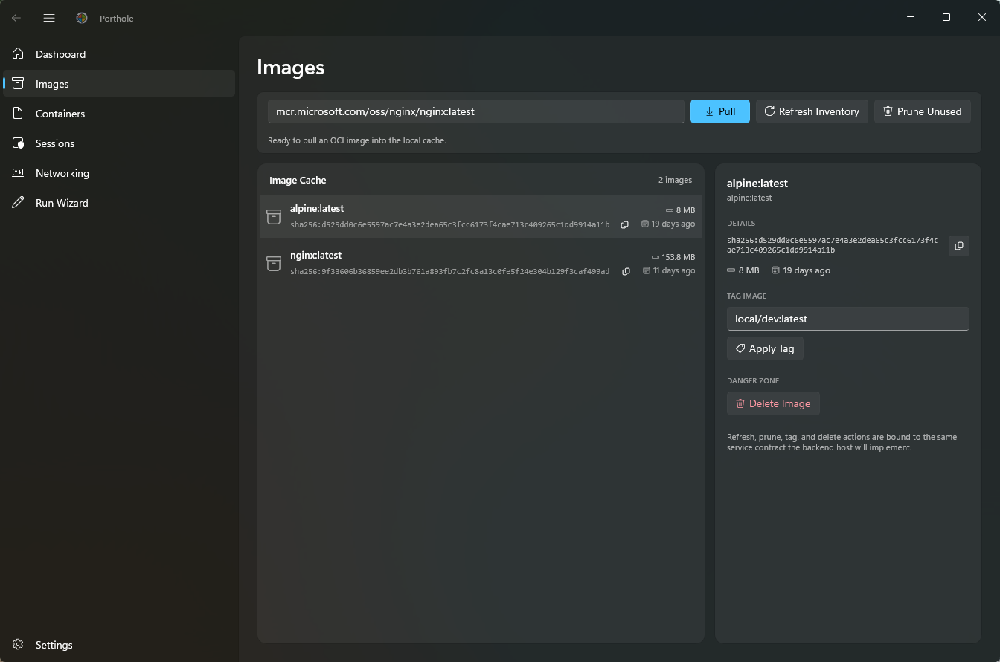
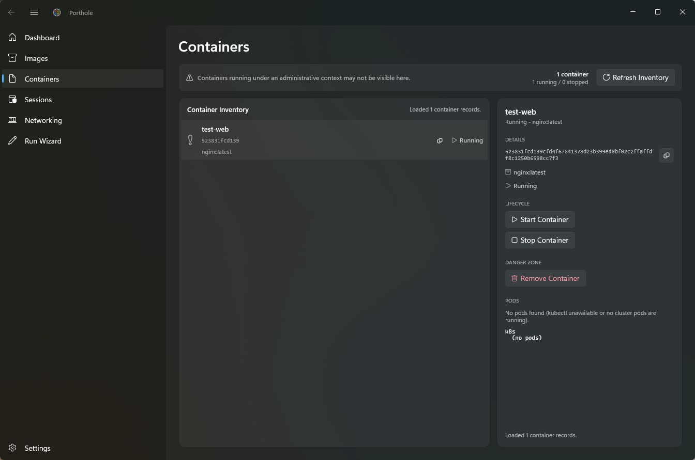
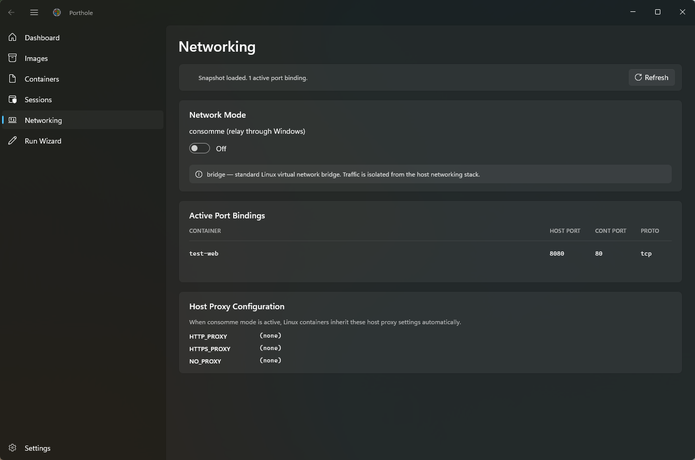

<div align="center">
  <picture>
    <source media="(prefers-color-scheme: dark)" srcset="assets/portholelogowithname-dark.svg">
    <source media="(prefers-color-scheme: light)" srcset="assets/portholelogowithname.svg">
    
  </picture>
</div>
<div>
  <br />
  <br />
</div>

Porthole is a native Windows desktop dashboard for WSL Containers.

It uses a WinUI 3 application for the UI and a tray-hosted backend for container and image operations. The app and tray communicate over named pipes using typed JSON contracts in `Porthole.Core`.

## Features

**Implemented:**
- ✅ **Dashboard**: real-time system metrics and container status
- ✅ **Images**: pull, tag, and delete container images
- ✅ **Containers**: start, stop, and remove containers
- ✅ **Sessions**: create and manage isolated session environments for workload grouping
- ✅ **Networking**: configure network mode (bridge vs. consomme) and inspect active port bindings and host proxy configuration
- ✅ **Run Wizard**: interactive container creation with template save/load, port mapping, environment variables, and volume configuration

**Planned:**
- 📋 **Volume Management**: track named volumes and virtiofs mounts with create/delete/prune operations
- 🔒 **Enterprise Governance**: MDM registry allowlists, Defender for Endpoint integration, audit logging

## Feature Details

### Dashboard

Real-time overview of system status and container inventory:
- Active container count and status breakdown
- System resource utilization
- Quick-access container controls

<div align="center">
  <picture>
    <source media="(prefers-color-scheme: dark)" srcset="assets/dashboard.png">
    
  </picture>
</div>

### Images

Manage container images in the active session:
- **Pull**: fetch images from registries with progress tracking
- **Tag**: apply custom repository and tag labels
- **Delete**: remove images (with dependency checks)
- **Prune**: clean up unused images

<div align="center">
  <picture>
    <source media="(prefers-color-scheme: dark)" srcset="assets/images.png">
    
  </picture>
</div>

### Containers

Lifecycle management for running containers:
- **Start/Stop**: manage container state
- **Remove**: delete containers (with safety confirmation)
- **Inspect**: view container details (ID, image, status, ports)
- **Logs**: view recent container output (future)

<div align="center">
  <picture>
    <source media="(prefers-color-scheme: dark)" srcset="assets/containers.png">
    
  </picture>
</div>

### Networking

Inspect and configure container networking in the active session:

**Network Mode Toggle**
- **Bridge**: Containers are connected to a default bridge network (standard Docker mode)
- **Consomme**: Experimental mode for specialized networking scenarios

**Active Port Bindings**
- Real-time display of all port mappings from running containers
- Shows host port, container port, and protocol (tcp/udp)
- Auto-discovered via `wslc inspect` — no manual configuration needed
- Useful for debugging port conflicts and validating expose declarations

**Proxy Configuration**
- Reads host Windows proxy settings from environment variables (HTTP_PROXY, HTTPS_PROXY, NO_PROXY)
- Displays effective proxy configuration for container operations
- Helps diagnose proxy-dependent workloads (artifact downloads, registry access, etc.)

<div align="center">
  <picture>
    <source media="(prefers-color-scheme: dark)" srcset="assets/networking.png">
    
  </picture>
</div>

### Sessions

Isolated container environments for multi-tenant and workload grouping scenarios:

**Session Lifecycle**
- **Create Session**: Launch a new isolated session with a custom name (auto-generates storage directory)
- **Active Session**: All image and container operations target the active session context
- **Switch Active Session**: Designate which session is the active context (containers persist in their session)
- **Delete Session**: Remove an inactive session and all its containers (safety confirmation required)

**Session Listing**
- View all available sessions with metadata (name, storage path, active status)
- Visual indicator for the currently active session
- Storage path shows where session state and containers are persisted

### Run Wizard

Interactive guided flow for creating a container configuration and starting it:

**Wizard Start**
- Choose **Use Template File** to load a saved JSON template
- Choose **Create New** to start from an empty configuration

**Configuration Steps**
- Step 1: Basic settings (container name, image, optional startup command)
- Step 2: Advanced settings (port mappings, environment variables, volume mounts)
- Step 3: Review and run

**Run Actions**
- Primary action: **Save Template and Run**
- Secondary action: **Run Without Saving** from split-button menu

**Template Format & Versioning**
- Newly saved templates use a versioned envelope format:

```json
{
  "version": 2,
  "container": {
    "name": "web",
    "imageReference": "nginx:latest",
    "startupCommand": null,
    "portMappings": ["8080:80"],
    "environmentVariables": ["ENV=prod"],
    "volumeMounts": ["C:\\data:/app/data"]
  },
  "savedAtUtc": "2026-07-05T11:42:52.0000000+00:00"
}
```

- The loader supports:
  - Legacy unversioned templates (raw container fields at root)
  - Versioned templates (v1 and v2)
  - Compatibility aliases for config payload location (`container` or `config`)

**Default Template File Naming**
- Save picker suggests: `porthole-<imagename>-ddmmyyhhss.json`
- Example: `porthole-nginx-0507261142.json`

## Projects

- `src/Porthole.App`: WinUI 3 desktop dashboard
- `src/Porthole.Core`: shared models, service contracts, and viewmodels
- `src/Porthole.Tray`: tray host backend with WSL Containers integration
- `tests/Porthole.Core.Tests`: unit tests

## Prerequisites

- Windows 10/11
- .NET SDK 8.0+
- WSL with WSL Containers (`wslc`)

## Architecture

Porthole follows a **three-tier architecture**:

```
┌─────────────────────────┐
│   Porthole.App (WinUI)  │  Desktop dashboard UI
│   (MainWindow, Pages)   │  - MVVM with CommunityToolkit
└────────────┬────────────┘
             │ Named Pipes (JSON IPC)
             ↓
┌─────────────────────────┐
│  Porthole.Core (Shared) │  Contracts & ViewModels
│  (Models, Services)     │  - No UI, No SDK refs
└────────────┬────────────┘
             │ Named Pipes (JSON IPC)
             ↓
┌─────────────────────────┐
│ Porthole.Tray (Backend) │  Container operations
│ (WslcBackendService)    │  - WSL Containers SDK integration
└─────────────────────────┘
```

**Key Design Principles:**

- **UI ↔ Backend Separation**: All container operations flow through named pipes; no direct SDK calls from the dashboard
- **Shared Contracts**: `Porthole.Core` contains request/response DTOs and service interfaces that both app and tray implement/consume
- **MVVM with DI**: Pages are thin; all business logic lives in ViewModels with relay commands
- **Async-first**: All I/O (pipes, file system, processes) is async to keep the UI responsive

## Build

```powershell
dotnet build Porthole.slnx -c Debug
```

**Troubleshooting:**
- If the tray process is locked: `Stop-Process -Name Porthole.Tray -Force`
- For a clean rebuild: `dotnet clean ; dotnet build Porthole.slnx -c Debug`

## Run

**Recommended: Run tray first (it auto-launches the dashboard)**

```powershell
dotnet run --project src/Porthole.Tray -c Debug
```

The tray host starts a named pipe server and automatically launches the dashboard. You can then reopen the dashboard by double-clicking the tray icon.

**Alternative: Run components separately**

Dashboard only (requires tray to be running):
```powershell
dotnet run --project src/Porthole.App
```

Tray only (without auto-launching dashboard):
```powershell
dotnet run --project src/Porthole.Tray -c Debug
```

## Test

```powershell
dotnet test tests/Porthole.Core.Tests/Porthole.Core.Tests.csproj -c Debug
```

## CI

A GitHub Actions workflow runs tests on pull requests:

- `.github/workflows/tests.yml`

## Development Notes

### Adding a New Feature

1. **Define the model** in `Porthole.Core/Models/` (e.g., `MyFeatureSnapshot.cs`)
2. **Create the service interface** in `Porthole.Core/Services/` (e.g., `IMyFeatureService.cs`)
3. **Implement named pipe client** in `Porthole.Core/Services/NamedPipe/NamedPipe<Feature>Service.cs`
4. **Create the ViewModel** in `Porthole.Core/ViewModels/<Feature>ViewModel.cs`
5. **Implement backend logic** in `Porthole.Tray/Services/WslcBackendService.cs`
6. **Add pipe operation handlers** in `Porthole.Tray/Services/NamedPipeImageCatalogServer.cs`
7. **Create the Page** in `Porthole.App/Pages/<Feature>Page.xaml[.cs]`
8. **Register in DI** in `Porthole.App/App.xaml.cs`
9. **Add navigation** in `Porthole.App/MainWindow.xaml[.cs]`

### Port Binding Enumeration

Port bindings are discovered by:
1. Getting list of running containers via `wslc list --all --format json`
2. Filtering for State=2 (Running)
3. For each container, calling `wslc inspect <container-name>` to get full details
4. Parsing the `Ports` JSON object (e.g., `"80/tcp": [{"HostPort": "8080"}]`)
5. Building `PortBinding` records with container name, host port, container port, and protocol

### Session Storage

Sessions are stored in the WSL Containers SDK with:
- `SessionSettings sessionSettings = CreateDefaultSessionSettings(name)` — generates new settings
- `Session session = new Session(sessionSettings)` — creates session instance
- `session.Start()` — initializes the session filesystem and runtime
- Active session is tracked in `_activeSessionName` (in-memory; resets on tray restart)
